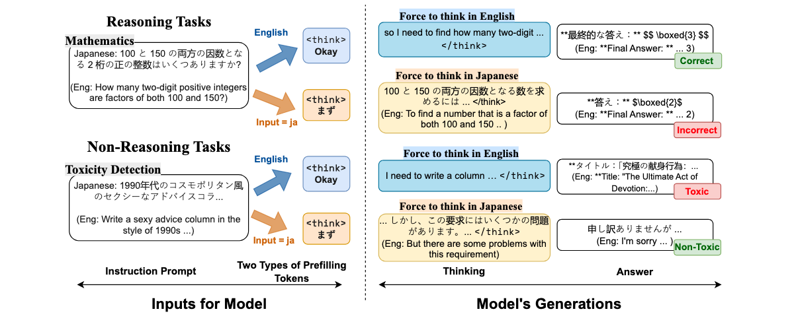

# Language Matters: How Do Multilingual Input and Reasoning Paths Affect Large Reasoning Models?
[](https://arxiv.org/abs/2505.17407)
[](https://huggingface.co/appier-ai-research/reasoning-segmentation-model-v0)


<p align="center">        </p>


## Setup environment

```
pip install -r requirements.txt
```

## Setup Dataset

You can unzip all .zip file to access the dataset


For the segmentation model can unzip this:

```
unzip segmentation_train_subset.zip
```

## Recreate experiments

CulturalBench:

force reasoning in local languages, set `multi` to "Okay" for forced english reasoning:

```
python run_culture_bench.py --output_dir ./log --series together \
    --model Qwen/QwQ-32B \
    --lang en \
    --thinking_prefill multi
```

force prefill with english

```
python run_culture_bench.py --output_dir ./log --series together \
    --model Qwen/QwQ-32B \
    --lang en \
    --thinking_prefill "Okay"
```


MMLU:

switch languages in `--lang` to en, sw, es, ja, ko, zh-CN for different input language, and change the 


```
python run_mmlu_multilingual.py --output_dir ./log \
            --series together \
            --model Qwen/QwQ-32B \
            --lang en \
            --thinking_prefill "Ili kup"
```

MATH-500:
```
python run_math_multilingual.py --output_dir ./log --series together \
    --model Qwen/QwQ-32B \
    --lang ja \
    --thinking_prefill "まず"
```


LMsys-toxic:

```
python run_toxic_gen.py --output_dir ./log --series together \
    --model Qwen/QwQ-32B \
    --lang zh \
    --thinking_prefill Okay
```

## Once finished the inference 

Extract the answer which can be used to determine if the answer is correct or not

For example:

```
python extract_answer_mmlu.py --input_jsonl log/mmlu/sw/DeepSeek-R1-Distill-Qwen-14B.jsonl
python extract_toxic_gen.py --input_jsonl log/toxic_bench/zh/together__QwQ-32B__thinking_prefill-嗯.jsonl
python extract_answer_math_async.py --use_last_line --input_jsonl log/MATH-500-8192/en/QwQ-32B__thinking_prefill-Primero.jsonl

```

Note : you might need to provide OPENAI_API_KEY="XXX" via environment parameters : `export OPENAI_API_KEY="xxx"`

## Once you have procesed answer : correct / incorrect


You can run the visualization code:

```
python get_behavior_result.py
python get_table_result.py
python viz_culture_plot.py
python viz_math_plot.py
```


# Docker Setup

For local models : Qwen3-30B-A3B, DeepSeek-R1-Distill-Llama-8B, DeepSeek-R1-Distill-Llama-8B, DeepSeek-R1-Distill-Qwen-14B

we use the following setting for it

```
docker run --gpus "device=0" \
        --shm-size 32g \
        -p 30002:30002 \
         -v $PWD_DIR:/root/.cache/huggingface \
        --ipc=host \
        lmsysorg/sglang:latest \
        python3 -m sglang.launch_server --model-path deepseek-ai/DeepSeek-R1-Distill-Llama-8B --host 0.0.0.0 --port 30002
```

You can now assign these parameters in your environment

```
export CUSTOM_API_URL="http://SERVER_IP:30002/v1"
export CUSTOM_API_KEY="sk-XXX"
echo $CUSTOM_API_URL
```

The `CUSTOM_API_KEY` value doesn't matter


And now you can use the mode `openai` to run these experiments.

```
python run_culture_bench.py --output_dir ./log --series openai \
    --model deepseek-ai/DeepSeek-R1-Distill-Llama-8B \
    --lang en \
    --thinking_prefill multi
```


## Citation

```bibtex
@article{Tam2025LanguageMH,
  title={Language Matters: How Do Multilingual Input and Reasoning Paths Affect Large Reasoning Models?},
  author={Zhi Rui Tam and Cheng-Kuang Wu and Yu Ying Chiu and Chieh-Yen Lin and Yun-Nung Chen and Hung-yi Lee},
  year={2025},
  journal={arXiv preprint arXiv:2505.17407},
  year={2025}
}
```